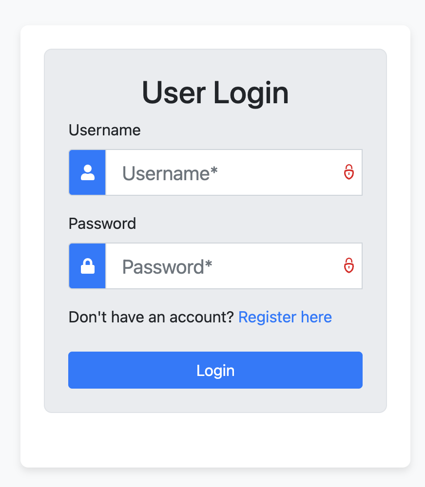
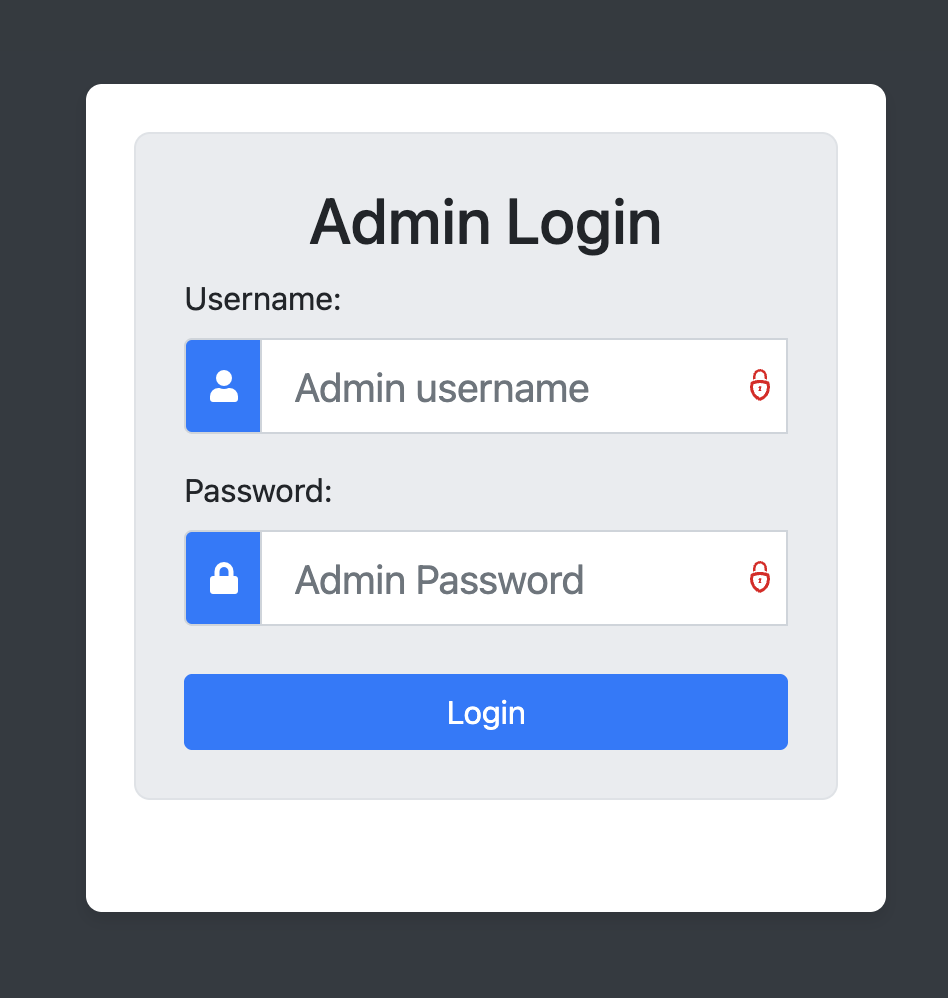
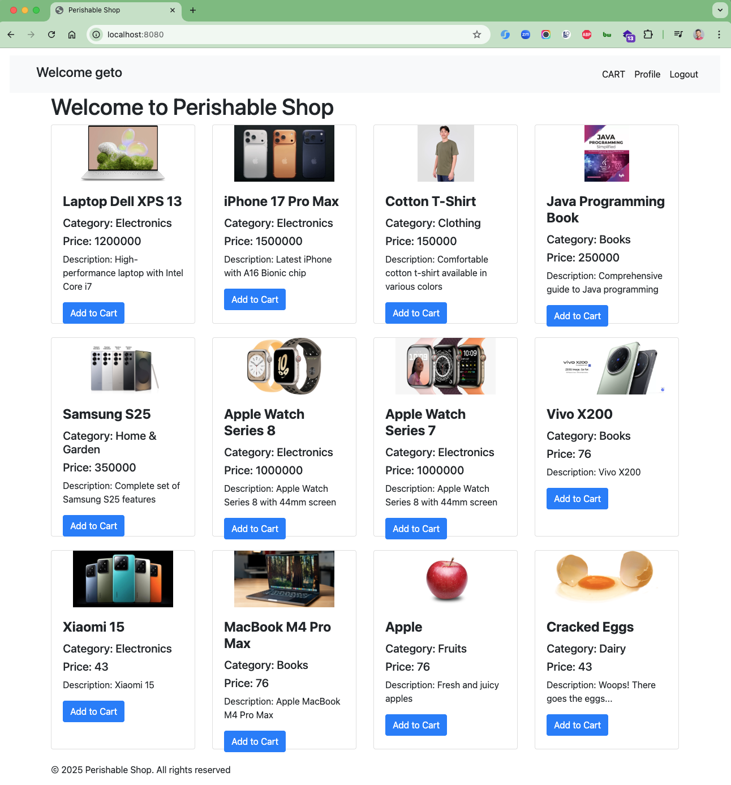
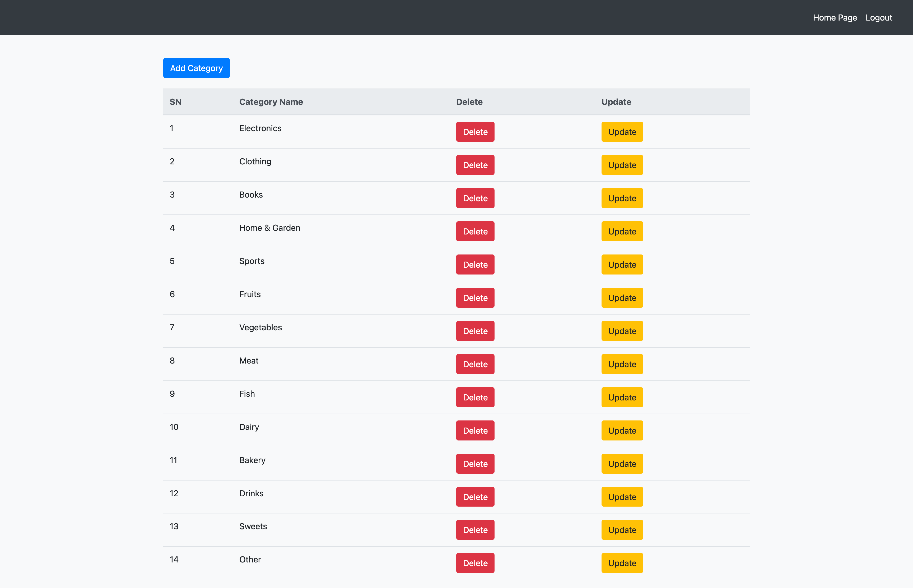
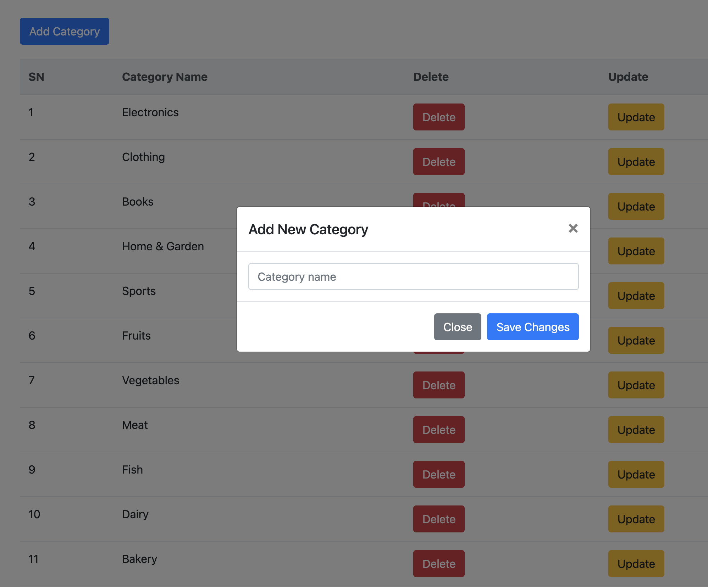
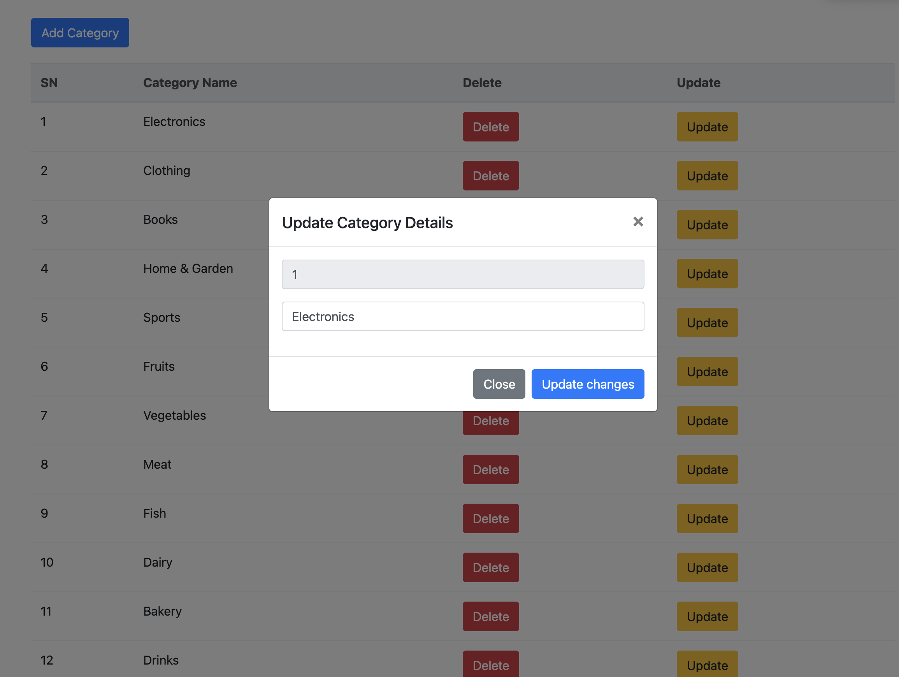
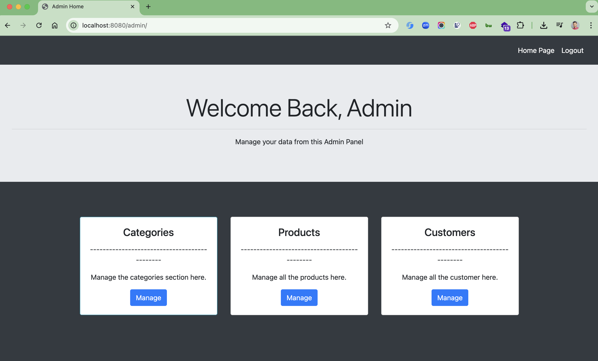
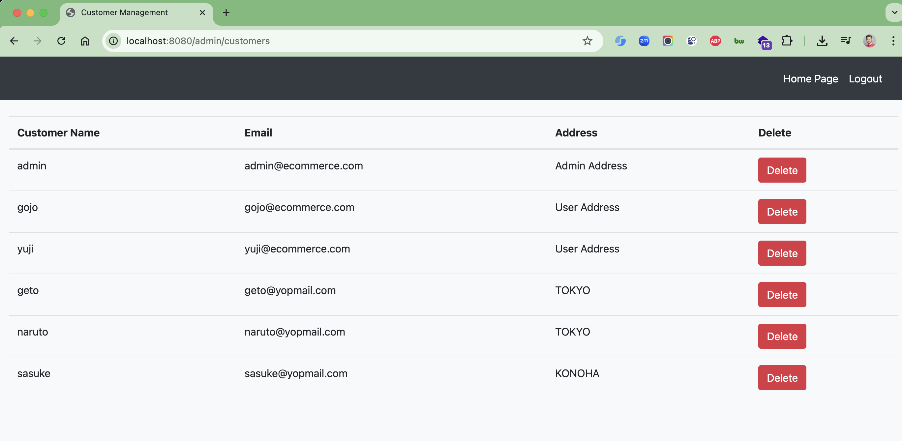

# 🛒 E-commerce Application

A modern Spring Boot 3 e-commerce application with secure authentication, product management, and shopping cart
functionality.

## 🚀 Features

### 👤 Authentication & Authorization

- **Dual Authentication System**: Separate login systems for administrators and regular users
- **BCrypt Password Encryption**: Secure password hashing with BCrypt
- **Role-Based Access Control**:
    - `ADMIN` role: Full administrative access
    - `USER` role: Customer shopping functionality
- **Spring Security Integration**: Latest Spring Boot 3 security standards

### 🛍️ E-commerce Functionality

- **Product Catalog**: Browse products by categories
- **Shopping Cart**: Add/remove products, manage quantities
- **Category Management**: Organized product categorization
- **User Management**: Customer registration and profile management

### 🗄️ Database & Migration

- **MySQL Database**: Robust relational database storage
- **Flyway Migration**: Version-controlled database schema management
- **Docker Compose Integration**: Automated database setup
- **Data Seeding**: Pre-populated with sample products and categories

### 🎨 Frontend

- **Thymeleaf Templates**: Server-side rendering with modern templating
- **Responsive Design**: Mobile-friendly user interface
- **Bootstrap Integration**: Professional styling and components

## 🛠️ Technology Stack

| Technology          | Version | Purpose                        |
|---------------------|---------|--------------------------------|
| **Java**            | 21      | Programming Language           |
| **Spring Boot**     | 3.5.5   | Application Framework          |
| **Spring Security** | 6.x     | Authentication & Authorization |
| **Spring Data JPA** | 3.x     | Data Persistence               |
| **Hibernate**       | 6.6.26  | ORM Framework                  |
| **Thymeleaf**       | 3.x     | Template Engine                |
| **MySQL**           | 9.4     | Database                       |
| **Flyway**          | 11.7.2  | Database Migration             |
| **Docker Compose**  | -       | Database Containerization      |
| **Maven**           | 3.x     | Build Tool                     |
| **Lombok**          | -       | Code Generation                |
| **BCrypt**          | -       | Password Encryption            |

## 🏗️ Architecture

```
src/
├── main/
│   ├── java/id/my/hendisantika/ecommerceapp1/
│   │   ├── config/
│   │   │   └── SecurityConfiguration.java       # Spring Security config
│   │   ├── controller/
│   │   │   ├── AdminController.java             # Admin endpoints
│   │   │   ├── UserController.java              # User endpoints
│   │   │   └── ErrorController.java             # Error handling
│   │   ├── entity/
│   │   │   ├── User.java                        # User entity
│   │   │   ├── Product.java                     # Product entity
│   │   │   ├── Category.java                    # Category entity
│   │   │   ├── Cart.java                        # Cart entity
│   │   │   ├── CartProduct.java                 # Cart-Product relationship
│   │   │   └── CartProductId.java               # Composite key
│   │   ├── repository/
│   │   │   ├── UserRepository.java              # User data access
│   │   │   ├── ProductRepository.java           # Product data access
│   │   │   ├── CategoryRepository.java          # Category data access
│   │   │   ├── CartRepository.java              # Cart data access
│   │   │   └── CartProductRepository.java       # Cart-Product data access
│   │   ├── service/
│   │   │   ├── UserService.java                 # User business logic
│   │   │   ├── ProductService.java              # Product business logic
│   │   │   ├── CategoryService.java             # Category business logic
│   │   │   └── CartService.java                 # Cart business logic
│   │   └── EcommerceApp1Application.java        # Main application
│   └── resources/
│       ├── db/migration/                        # Flyway migrations
│       │   ├── V1_14092025_065917__Create_initial_ecommerce_schema.sql
│       │   ├── V2_14092025_071203__Fix_schema_and_sequence_tables.sql
│       │   └── V3_14092025_080142__Update_user_passwords.sql
│       ├── templates/                           # Thymeleaf templates
│       └── application.properties               # Configuration
└── test/                                        # Unit tests
```

## 🚀 Quick Start

### Prerequisites

- Java 21+
- Maven 3.6+
- Docker & Docker Compose

### Installation & Setup

1. **Clone the repository**
   ```bash
   git clone <repository-url>
   cd ecommerce-app1
   ```

2. **Start the application**
   ```bash
   ./mvnw spring-boot:run
   ```

   The application will:
    - Automatically start MySQL container via Docker Compose
    - Run Flyway migrations to set up the database schema
    - Start the web server on `http://localhost:8080`

3. **Access the application**
    - **User Interface**: `http://localhost:8080`
    - **Admin Interface**: `http://localhost:8080/admin`

## 👥 Default User Accounts

The application comes pre-configured with test accounts:

| Username | Password   | Role  | Access                     |
|----------|------------|-------|----------------------------|
| `admin`  | `admin123` | ADMIN | Full administrative access |
| `gojo`   | `admin123` | USER  | Customer shopping features |
| `yuji`   | `admin123` | USER  | Customer shopping features |

## 🔗 API Endpoints

### Authentication Endpoints

- `GET /login` - User login page
- `POST /userloginvalidate` - Process user login
- `GET /admin/login` - Admin login page
- `POST /admin/loginvalidate` - Process admin login
- `GET /logout` - User logout
- `GET /admin/logout` - Admin logout

### User Endpoints

- `GET /` - Home page / Product catalog
- `GET /register` - User registration page
- `POST /newuserregister` - Process user registration
- `GET /cart` - View shopping cart
- `POST /cart/add` - Add product to cart

### Admin Endpoints

- `GET /admin/` - Admin dashboard
- `GET /admin/products` - Manage products
- `GET /admin/categories` - Manage categories
- `GET /admin/users` - Manage users

## 🗄️ Database Schema

### Core Tables

- **`customer`** - User accounts and profiles
- **`category`** - Product categories
- **`product`** - Product catalog
- **`cart`** - Shopping carts
- **`cart_product`** - Cart-Product relationships

### Sample Data

- **14 Categories**: Electronics, Clothing, Books, Fruits, Vegetables, etc.
- **11 Products**: Laptops, iPhones, T-shirts, Books, Samsung devices, etc.
- **3 Users**: 1 Admin + 2 Regular users

## 🔧 Configuration

### Database Configuration

```properties
# MySQL Database
spring.datasource.url=jdbc:mysql://localhost:3306/ecommerce?createDatabaseIfNotExist=true
spring.datasource.username=yu71
spring.datasource.password=53cret
# Flyway Migration
spring.flyway.enabled=true
spring.flyway.locations=classpath:db/migration
spring.flyway.baseline-on-migrate=true
```

### Security Configuration

- **Password Encryption**: BCrypt with strength 10
- **Session Management**: Cookie-based authentication
- **CSRF Protection**: Disabled for API endpoints
- **Role Hierarchy**: ADMIN > USER

## 🧪 Testing

### Run Tests

```bash
# Run all tests
./mvnw test

# Run specific test
./mvnw test -Dtest=LoginFunctionalityTest
```

### Test Coverage

- ✅ **Password Hashing**: BCrypt verification
- ✅ **Admin Login**: Authentication & role validation
- ✅ **User Login**: Authentication & role validation
- ✅ **Invalid Login**: Security verification

## 🔄 Database Migration

The application uses Flyway for database versioning:

```bash
# Check migration status
./mvnw flyway:info

# Apply migrations
./mvnw flyway:migrate

# Repair migration history
./mvnw flyway:repair
```

### Migration Files

- **V1**: Initial schema creation
- **V2**: Sequence tables for auto-increment IDs
- **V3**: Password hash updates for security

## 🐳 Docker Support

### MySQL Container

```bash
# Start MySQL container
docker-compose up -d

# Stop MySQL container
docker-compose down
```

### Application Properties

```properties
# Docker Compose integration
spring.docker.compose.enabled=true
spring.docker.compose.lifecycle-management=start_and_stop
```

## 📝 Development

### Adding New Features

1. **Create Entity**: Define JPA entity in `entity/` package
2. **Create Repository**: Extend JpaRepository in `repository/` package
3. **Create Service**: Add business logic in `service/` package
4. **Create Controller**: Handle HTTP requests in `controller/` package
5. **Create Migration**: Add Flyway migration in `db/migration/`
6. **Add Tests**: Write unit tests in `test/` package

### Code Style

- **Java 21** features and syntax
- **Lombok** for reducing boilerplate
- **Spring Boot** best practices
- **RESTful** API design
- **Secure coding** standards

## 🔒 Security Features

- **Password Hashing**: BCrypt encryption for all user passwords
- **Role-Based Authorization**: Granular access control
- **Session Management**: Secure cookie handling
- **Input Validation**: Server-side validation
- **SQL Injection Prevention**: JPA/Hibernate protection

## 🚀 Deployment

### Production Checklist

- [ ] Update database credentials
- [ ] Enable HTTPS/SSL
- [ ] Configure production logging
- [ ] Set up monitoring
- [ ] Configure backups
- [ ] Update security headers

### Environment Profiles

- **`test`**: Development testing
- **`prod`**: Production deployment

## 🤝 Contributing

1. Fork the repository
2. Create a feature branch: `git checkout -b feature-name`
3. Commit changes: `git commit -m 'Add feature'`
4. Push to branch: `git push origin feature-name`
5. Submit a pull request

## 📄 License

This project is licensed under the MIT License - see the [LICENSE](LICENSE) file for details.

## 🏷️ Version History

- **v1.0.0** - Initial release with basic e-commerce functionality
- **v1.1.0** - Added Spring Boot 3 support and Flyway migrations
- **v1.2.0** - Enhanced security with BCrypt and role-based access
- **v1.2.1** - Fixed 403 Forbidden error on home page access

## 🆘 Troubleshooting

### Common Issues

1. **403 Forbidden Error**
    - **Issue**: Getting 403 error when accessing home page
    - **Cause**: Spring Security requires authentication for all pages except login/register
    - **Solution**: Home page (`/`) is now publicly accessible
    - **Fixed in**: SecurityConfiguration.java line 97

2. **Database Connection Failed**
   ```bash
   # Start Docker Compose
   docker-compose up -d
   ```

3. **Migration Errors**
   ```bash
   # Repair migration
   ./mvnw flyway:repair
   ```

4. **Login Issues**
    - Default password: `admin123`
    - Check user roles in database

### Support

For support, please open an issue on GitHub or contact the development team.

---

**Built with ❤️ using Spring Boot 3 and modern Java**

### Image Screenshots

User Login Page



Admin Login Page



Product Catalog



Category Management



Add Category



Update Category



Dashboard



Customer Profile

